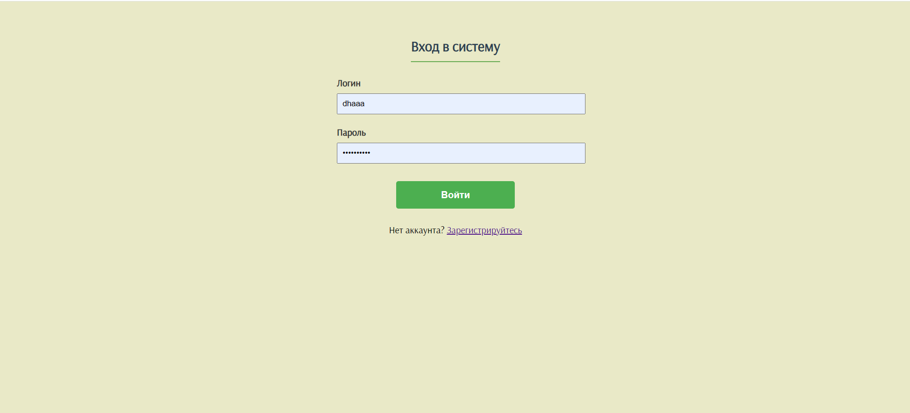
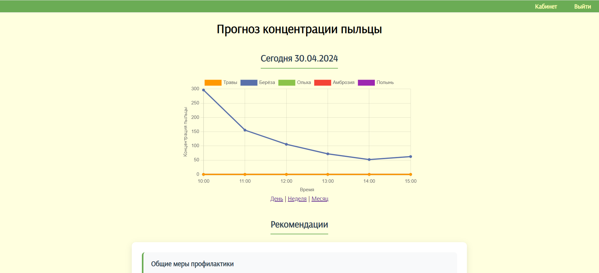
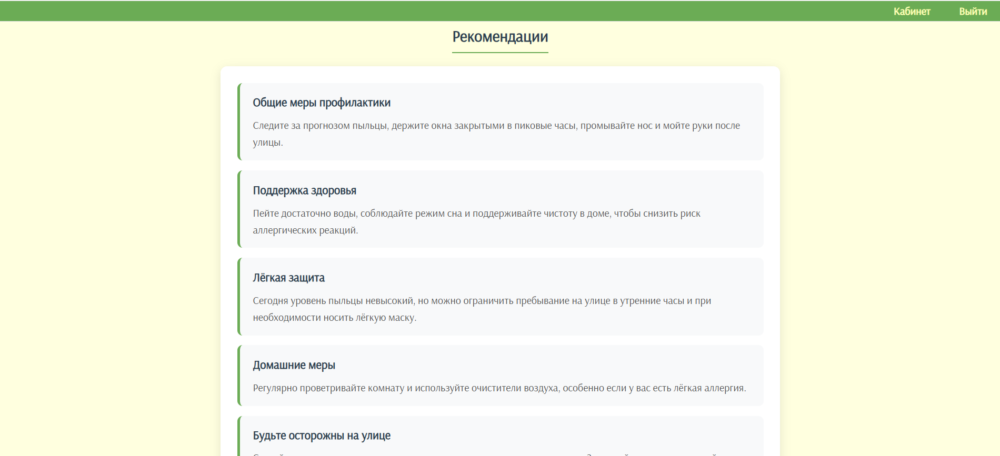
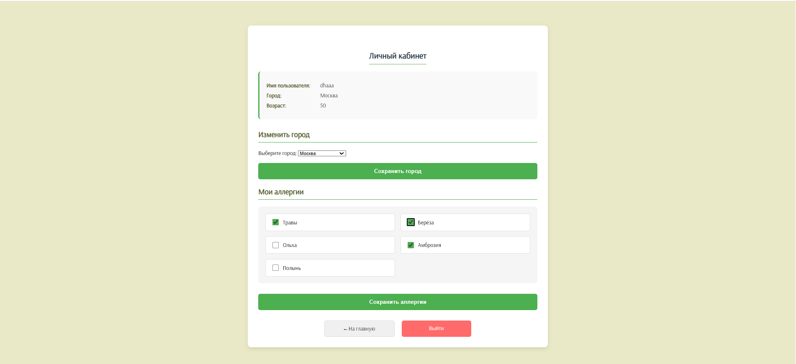

# Pollen Tracker 🌿  
Веб-сервис прогнозирования аллергенной пыльцы

## Описание проекта
**Pollen Tracker** — это веб-приложение для людей, страдающих сезонной аллергией.  
Сервис предоставляет персонализированный прогноз концентрации аллергенной пыльцы в атмосфере, учитывая:

- город проживания пользователя  
- типы пыльцы, на которые у него аллергия  
- индивидуальную чувствительность  

На основе этих данных система рассчитывает уровень риска и генерирует рекомендации для снижения симптомов аллергии.

---

## Интерфейс приложения

### Регистрация


### Главная страница



### Персонализированные рекомендации


### Профиль


## Основные возможности

- Регистрация и настройка профиля пользователя
- Выбор аллергенов и уровня чувствительности
- Просмотр прогноза концентрации пыльцы:
  - на день
  - на неделю
  - на месяц
- Интерактивные графики концентрации пыльцы
- Персонализированные рекомендации при повышенном уровне риска
- Автоматическое обновление данных через внешний API
- Прогнозирование пыльцы на месяц вперед на основе исторических данных

---

## Роли пользователей

### Зарегистрированный пользователь
- Просмотр персонализированных прогнозов пыльцы
- Настройка профиля (город, аллергены, чувствительность)
- Получение рекомендаций на основе уровня риска

### Администратор
- Управление типами пыльцы
- Управление рекомендациями
- Просмотр и редактирование данных через Django Admin

---

## Архитектура проекта

Проект построен по модульному принципу:

- **Модели данных** — описание пользователей, аллергенов и измерений
- **API-интеграции** — получение данных о пыльце из Open-Meteo
- **Аналитика** — обработка исторических данных и прогнозирование
- **Рекомендательная система** — расчет риска и генерация рекомендаций
- **Визуализация** — графики концентрации пыльцы на фронтенде

---

## Модели данных

- **UserProfile** — профиль пользователя (город, координаты, возраст)
- **PollenType** — типы пыльцы и их характеристики
- **PollenData** — данные о концентрации пыльцы
- **UserAllergy** — связь пользователя с аллергенами и уровнем чувствительности
- **Recommendation** — рекомендации для пользователей

---

## Используемые технологии

### Backend
- Python 3.9+
- Django 4.x
- Django ORM
- Django Admin

### Database
- SQLite — для разработки
- PostgreSQL — для продакшена

### Frontend
- HTML / CSS / JavaScript
- Chart.js — визуализация данных

### Аналитика и прогнозирование
- Pandas
- NumPy

### Внешние сервисы
- Open-Meteo API — получение данных о концентрации пыльцы

---

## Алгоритмы и логика

- **Модуль прогнозирования**  
  Строит прогноз концентрации пыльцы на месяц вперед с учетом сезонных паттернов

- **Модуль оценки риска**  
  Рассчитывает уровень риска на основе:
  - концентрации пыльцы
  - коэффициента аллергенности
  - чувствительности пользователя

- **Модуль рекомендаций**  
  Генерирует персонализированные рекомендации при повышенном уровне риска

---

## Установка и запуск проекта
S
```bash
git clone https://github.com/ddhhaa/pollen-project.git
cd pollen-tracker

python -m venv venv
source venv/bin/activate  # Linux / macOS
venv\Scripts\activate     # Windows

pip install -r requirements.txt
python manage.py migrate
python manage.py createsuperuser
python manage.py runserver
